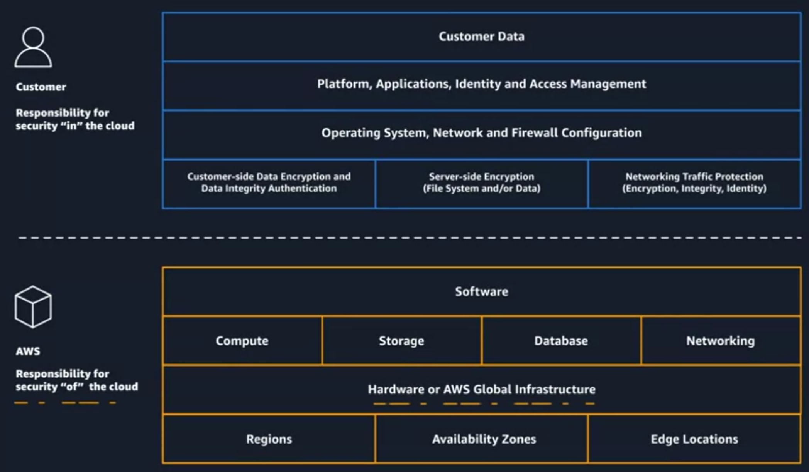
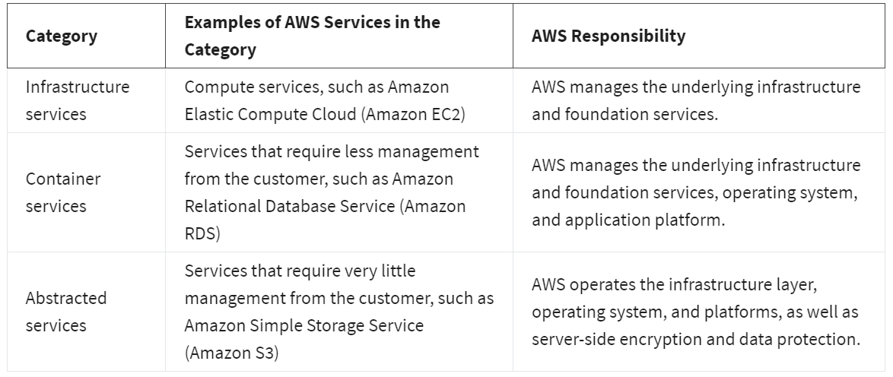
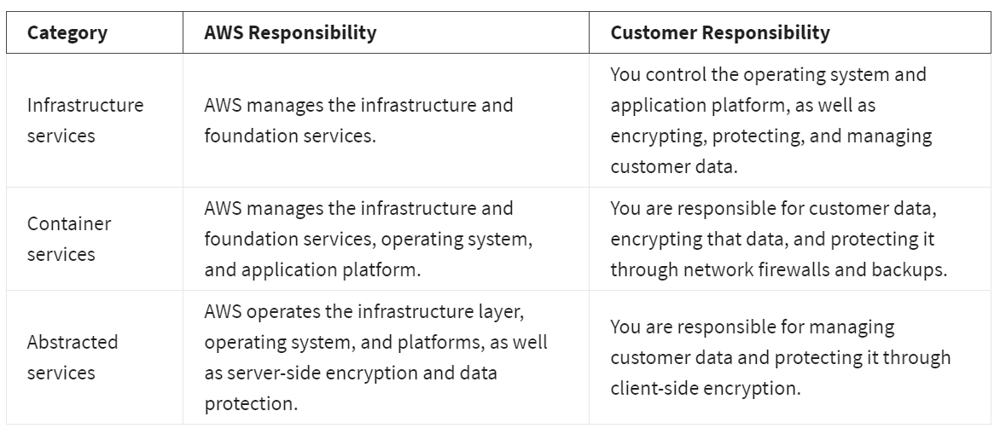

# Security and shared responsibility model

Some parts of the application are secured by AWS, while others are the user's responsibility.

The shared responsibility scheme is:

Thus, AWS scope is:

While on the customer side:

