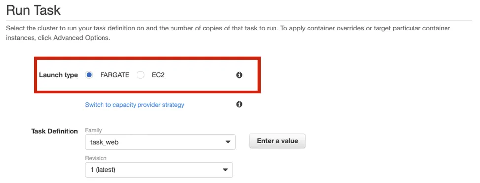
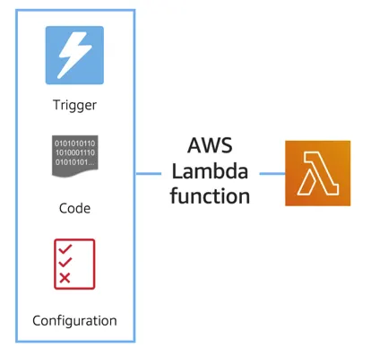

# Reading 2.4: Serverless and AWS Lambda

## REMOVE THE UNDIFFERENTIATED HEAVY LIFTING

If you run your code on Amazon EC2, AWS is responsible for the physical hardware and you are responsible for the logical controls, such as guest operating system, security and patching, networking, security, and scaling. If you run your code in containers on Amazon ECS and Amazon EKS, AWS is responsible for more of the container management, such as deploying containers across EC2 instances and managing the container cluster. However, when running ECS and EKS on EC2, you are still responsible for maintaining the underlying EC2 instances. If you want to deploy your workloads and applications without having to manage any EC2 instances, you can do that on AWS with serverless compute.

## GO SERVERLESS

Every definition of serverless mentions four aspects:

- No servers to provision or manage.
- Scales with usage.
- You never pay for idle resources.
- Availability and fault tolerance are built-in.

With serverless, spend time on the things that differentiate your application, rather than spending time on ensuring availability, scaling, and managing servers. AWS has several serverless compute options, including AWS Fargate and AWS Lambda.

## EXPLORE SERVERLESS CONTAINERS WITH AWS FARGATE

Amazon ECS and Amazon EKS enable you to run your containers in two modes:

- Amazon EC2 mode
- AWS Fargate mode



AWS Fargate is a purpose-built serverless compute engine for containers. Fargate scales and manages the infrastructure, allowing developers to work on what they do best: application development. It achieves this by allocating the right amount of compute, eliminating the need to choose and handle EC2 Instances and cluster capacity and scaling. Fargate supports both Amazon ECS and Amazon EKS architecture and provides workload isolation and improved security by design.

AWS Fargate abstracts the EC2 instance so you’re not required to manage it. However, with AWS Fargate, you can use all the same ECS primitives, APIs, and AWS integrations. It natively integrates with AWS Identity and Access Management (IAM) and Amazon Virtual Private Cloud (VPC). Having native integration with Amazon VPC allows you to launch Fargate containers inside your network and control connectivity to your applications.

## RUN YOUR CODE ON AWS LAMBDA

If you want to deploy your workloads and applications without having to manage any EC2 instances or containers, you can use AWS Lambda. AWS Lambda lets you run code without provisioning or managing servers or containers. You can run code for virtually any type of application or backend service, including data processing, real-time stream processing, machine learning, WebSockets, IoT backends, mobile backends, and web apps, like your corporate directory app!

AWS Lambda requires zero administration from the user. You upload your source code and Lambda takes care of everything required to run and scale your code with high availability. There are no servers to manage, bringing you continuous scaling with subsecond metering and consistent performance.

## HOW LAMBDA WORKS

There are three primary components of a Lambda function: the trigger, code, and configuration. The code is source code, that describes what the Lambda function should run. This code can be authored in three ways:



- You create the code from scratch.
- You use a blueprint that AWS provides.
- You use same code from the AWS Serverless Application Repository, a resource that contains sample applications, such as “hello world” code, Amazon Alexa Skill sample code, image resizing code, video encoding, and more.

When you create your Lambda function, you specify the runtime you want your code to run in. There are built-in runtimes such as Python, Node.js, Ruby, Go, Java, .NET Core, or you can implement your Lambda functions to run on a custom runtime. The configuration of a Lambda function consists of information that describes how the function should run. In the configuration, you specify network placement, environment variables, memory, invocation type, permission sets, and other configurations. To dive deeper into these configurations, check out the resources section of this unit. Triggers describe when the Lambda function should run.

A trigger integrates your Lambda function with other AWS services, enabling you to run your Lambda function in response to certain API calls that occur in your AWS account. This makes you quicker to respond to events in your console without having to perform manual actions. All you need is the what, how, and when of a Lambda function to have functional compute capacity that runs only when you need it to. Amazon’s CTO, Werner Vogels, says, “No server is easier to manage than no server.” This quote summarizes the convenience you can have when running serverless solutions, like AWS Fargate and AWS Lambda.

In the next unit, you apply all the information you’ve learned about Amazon EC2, Amazon ECS and Amazon EKS, and AWS Fargate and learn the use cases for each service.

## AWS Lambda function handler

The AWS Lambda function handler is the method in your function code that processes events. When your function is invoked, Lambda runs the handler method. When the handler exits or returns a response, it becomes available to handle another event. You can use the following general syntax when creating a function handler in Python:

```python
def handler_name(event, context):
    ...
    return some_value
```

## NAMING
The Lambda function handler name specified at the time you create a Lambda function is derived from the following: the name of the file in which the Lambda handler function is located and the name of the Python handler function. A function handler can be any name; however, the default on the Lambda console is lambda_function.lambda_handler. This name reflects the function name as lambda_handler, and the file where the handler code is stored in lambda_function.py. If you choose a different name for your function handler on the Lambda console, you must update the name on the Runtime settings pane.

## BILLING GRANULARITY
AWS Lambda lets you run code without provisioning or managing servers, and you pay only for what you use. You are charged for the number of times your code is triggered (requests) and for the time your code executes, rounded up to the nearest 1ms (duration). AWS rounds up duration to the nearest millisecond with no minimum execution time. With this pricing, it can be very cost effective to run functions whose execution time is very low, such as functions with durations under 100ms or low latency APIs. For more information, see AWS News Blog.

## SOURCE CODE
This video used a small amount of sample code illustrating a pattern for lazily generating assets using AWS Lambda and Amazon S3. If you’re looking to deploy a service to resize images to production, consider using the new release Serverless Image Handler which is a robust solution to handle image manipulation and can be deployed via an AWS CloudFormation template.

You can find a tutorial on creating the AWS Lambda function as well as the code used in the AWS Lambda demo here: see AWS News Blog.