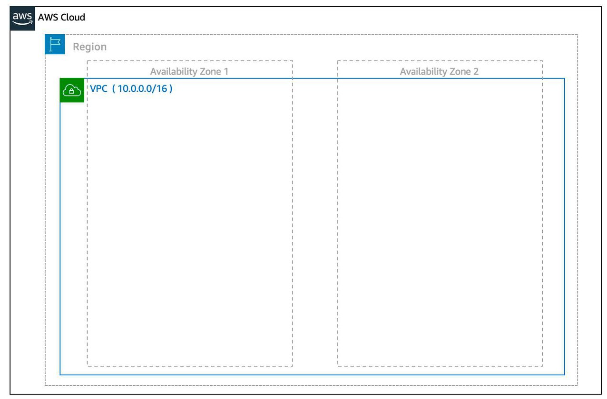
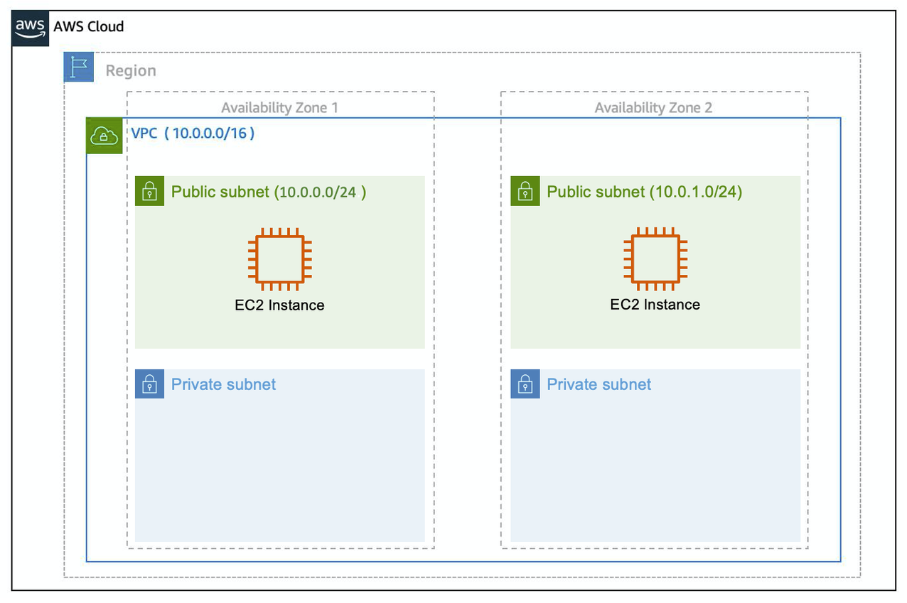

# Reading 2.6: Introduction to Amazon VPC

A VPC is an isolated network you create in the AWS cloud, similar to a traditional network in a data center. When you create a VPC, you need to choose three main things:

- The name of your VPC.
- A Region for your VPC to live in. Each VPC spans multiple Availability Zones within the Region you choose.
- An IP range for your VPC in CIDR notation. This determines the size of your network. Each VPC can have up to four /16 IP ranges.

Using this information, AWS will provision a network and IP addresses for that network.

## Create a Subnet

After you create your VPC, you need to create subnets inside of this network. Think of subnets as smaller networks inside your base network—or virtual area networks (VLANs) in a traditional, on-premises network. In an on-premises network, the typical use case for subnets is to isolate or optimize network traffic. In AWS, subnets are used for high availability and providing different connectivity options for your resources. When you create a subnet, you need to choose three settings:

- The VPC you want your subnet to live in, in this case VPC (10.0.0.0/16).
- The Availability Zone you want your subnet to live in, in this case AZ1.
- A CIDR block for your subnet, which must be a subset of the VPC CIDR block, in this case 10.0.0.0/24.

When you launch an EC2 instance, you launch it inside a subnet, which will be located inside the Availability Zone you choose.

## High Availability with A VPC

When you create your subnets, keep high availability in mind. In order to maintain redundancy and fault tolerance, create at least two subnets configured in two different Availability Zones.

As you learned earlier in the trail, it’s important to consider that “everything fails all the time.” In this case, if one of these AZs fail, you still have your resources in another AZ available as backup.

## Reserved IPs

For AWS to configure your VPC appropriately, AWS reserves five IP addresses in each subnet. These IP addresses are used for routing, Domain Name System (DNS), and network management.

For example, consider a VPC with the IP range 10.0.0.0/22. The VPC includes 1,024 total IP addresses. This is divided into four equal-sized subnets, each with a /24 IP range with 256 IP addresses. Out of each of those IP ranges, there are only 251 IP addresses that can be used because AWS reserves five.

Since AWS reserves these five IP addresses, it can impact how you design your network. A common starting place for those who are new to the cloud is to create a VPC with an IP range of /16 and create subnets with an IP range of /24. This provides a large amount of IP addresses to work with at both the VPC and subnet level.

## Gateways

### Internet Gateway

To enable internet connectivity for your VPC, you need to create an internet gateway. Think of this gateway as similar to a modem. Just as a modem connects your computer to the internet, the internet gateway connects your VPC to the internet. Unlike your modem at home, which sometimes goes down or offline, an internet gateway is highly available and scalable. After you create an internet gateway, you then need to attach it to your VPC.

### Virtual Private Gateway

A virtual private gateway allows you to connect your AWS VPC to another private network. Once you create and attach a VGW to a VPC, the gateway acts as an anchor on the AWS side of the connection. On the other side of the connection, you’ll need to connect a customer gateway to the other private network. A customer gateway device is a physical device or software application on your side of the connection. Once you have both gateways, you can then establish an encrypted VPN connection between the two sides.
