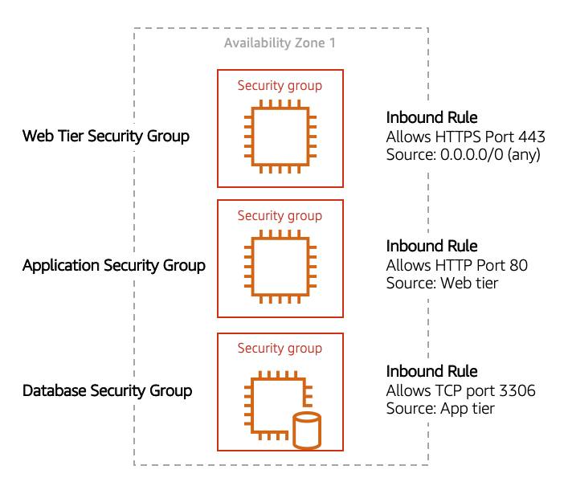

# Reading 2.7: Amazon VPC Routing and Security

## The Main Route Table

When you create a VPC, AWS creates a route table called the main route table. A route table contains a set of rules, called routes, that are used to determine where network traffic is directed. AWS assumes that when you create a new VPC with subnets, you want traffic to flow between them. Therefore, the default configuration of the main route table is to allow traffic between all subnets in the local network. Below is an example of a main route table:

There are two main parts to this route table:

- **The destination**, which is a range of IP addresses where you want your traffic to go. In the example of sending a letter, you need a destination to route the letter to the appropriate place. The same is true for routing traffic. In this case, the destination is the IP range of our VPC network.
- **The target**, which is the connection through which to send the traffic. In this case, the traffic is routed through the local VPC network.

## Custom Route Tables

While the main route table controls the routing for your VPC, you may want to be more granular about how you route your traffic for specific subnets. For example, your application may consist of a frontend and a database. You can create separate subnets for these resources and provide different routes for each of them.

If you associate a custom route table with a subnet, the subnet will use it instead of the main route table. By default, each custom route table you create will have the local route already inside it, allowing communication to flow between all resources and subnets inside the VPC.

## Secure Your Subnets with Network ACLs

Think of a network ACL as a firewall at the subnet level. A network ACL enables you to control what kind of traffic is allowed to enter or leave your subnet. You can configure this by setting up rules that define what you want to filter. Here’s an example.

### Inbound

| Rule # | Type           | Protocol | Port Range | Source  | Allow/Deny |
|--------|----------------|----------|------------|---------|------------|
| 100    | All IPv4 traffic | All      | All        | 0.0.0.0/0 | ALLOW      |
| *      | All IPv4 traffic | All      | All        | 0.0.0.0/0 | DENY       |

### Outbound

| Rule # | Type           | Protocol | Port Range | Source  | Allow/Deny |
|--------|----------------|----------|------------|---------|------------|
| 100    | All IPv4 traffic | All      | All        | 0.0.0.0/0 | ALLOW      |
| *      | All IPv4 traffic | All      | All        | 0.0.0.0/0 | DENY       |

The default network ACL, shown in the table above, allows all traffic in and out of your subnet. To allow data to flow freely to your subnet, this is a good starting place. However, you may want to restrict data at the subnet level. For example, if you have a web application, you might restrict your network to allow HTTPS traffic and remote desktop protocol (RDP) traffic to your web servers.

### Inbound

| Rule # | Source IP     | Protocol | Port | Allow/Deny | Comments                                                                             |
|--------|---------------|----------|------|------------|--------------------------------------------------------------------------------------|
| 100    | All IPv4 traffic | TCP      | 443  | ALLOW      | Allows inbound HTTPS traffic from anywhere                                           |
| 130    | 192.0.2.0/24  | TCP      | 3389 | ALLOW      | Allows inbound RDP traffic to the web servers from your home network’s public IP address range (over the internet gateway) |
| *      | All IPv4 traffic | All      | All  | DENY       | Denies all inbound traffic not already handled by a preceding rule (not modifiable)  |

### Outbound

| Rule # | Destination IP | Protocol | Port        | Allow/Deny | Comments                                                                       |
|--------|----------------|----------|-------------|------------|--------------------------------------------------------------------------------|
| 120    | 0.0.0.0/0      | TCP      | 1025-65535  | ALLOW      | Allows outbound responses to clients on the internet (serving people visiting the web servers in the subnet) |
| *      | 0.0.0.0/0      | All      | All         | DENY       | Denies all outbound traffic not already handled by a preceding rule (not modifiable) |

Notice that in the network ACL example above, you allow inbound 443 and outbound range 1025-65535. That’s because HTTP uses port 443 to initiate a connection and will respond to an ephemeral port. Network ACLs are considered stateless, so you need to include both the inbound and outbound ports used for the protocol. If you don’t include the outbound range, your server would respond but the traffic would never leave the subnet.

Since network ACLs are configured by default to allow incoming and outgoing traffic, you don’t need to change their initial settings unless you need additional security layers.

## Secure Your EC2 Instances with Security Groups

The next layer of security is for your EC2 Instances. Here, you can create a firewall called a security group. The default configuration of a security group blocks all inbound traffic and allows all outbound traffic.

You might be wondering: “Wouldn’t this block all EC2 instances from receiving the response of any customer requests?” Well, security groups are stateful, meaning they will remember if a connection is originally initiated by the EC2 instance or from the outside and temporarily allow traffic to respond without having to modify the inbound rules.

If you want your EC2 instance to accept traffic from the internet, you’ll need to open up inbound ports. If you have a web server, you may need to accept HTTP and HTTPS requests to allow that type of traffic in through your security group. You can create an inbound rule that will allow port 80 (HTTP) and port 443 (HTTPS) as shown below.

### Inbound rules

| Type       | Protocol | Port Range | Source  |
|------------|----------|------------|---------|
| HTTP (80)  | TCP (6)  | 80         | 0.0.0.0/0 |
| HTTP (80)  | TCP (6)  | 80         | ::/0    |
| HTTPS (443)| TCP (6)  | 443        | 0.0.0.0/0 |
| HTTPS (443)| TCP (6)  | 443        | ::/0    |

You learned in a previous unit that subnets can be used to segregate traffic between computers in your network. Security groups can be used to do the same thing. A common design pattern is organizing your resources into different groups and creating security groups for each to control network communication between them.

This example allows you to define three tiers and isolate each tier with the security group rules you define. In this case, you only allow internet traffic to the web tier over HTTPS, Web Tier to Application Tier over HTTP, and Application tier to Database tier over MySQL. This is different from traditional on-premises environments, in which you isolate groups of resources via VLAN configuration. In AWS, security groups allow you to achieve the same isolation without tying it to your network.
