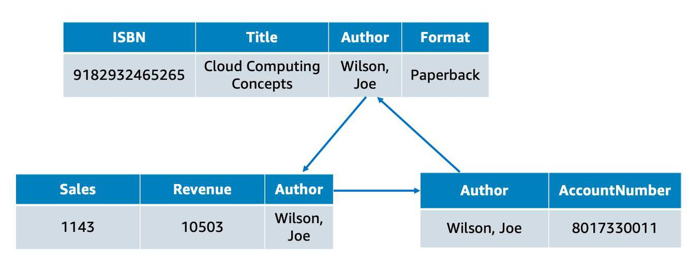
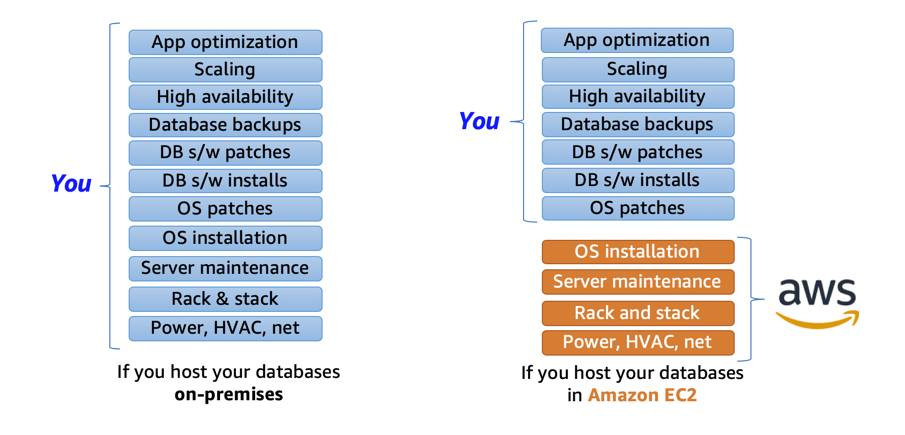
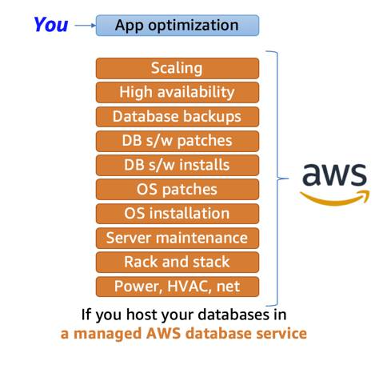

# Introduction

It is possible to host a db on EC2, in this case it is the responsibility of the user to:
1. Install DB and patches,
2. Configure backups,
3. Set availability, scaling and optimization.

Alternatively, it is possible to use AWS to configure the DB, leaving only the optimization of the DB for the user: 

1. Schema creation,
2. Index creation,
3. Stores procedures,
4. Data encryption,
5. Access control,
6. Query optimization.

# Reading 3.5: Explore Databases on AWS

## Explore Databases on AWS

### Understanding the History Behind Enterprise Databases

Choosing a database used to be a straightforward decision. There were only a few options to choose from. In the past, you likely considered a few vendors and then inevitably chose one for all of your applications.

Businesses often selected the database technology they were going to use, even before they fully understood their use case. Since the 1970s, the database most commonly selected by businesses was a relational database.

### What is a Relational Database?

A relational database organizes data into tables. Data in one table can be linked to data in other tables to create relationships—hence, the relational part of the name.

A table stores data in rows and columns. A row, often called a record, contains all information about a specific entry. Columns describe attributes of that entry. Here’s an example of three tables in a relational database.

This shows a table for books, a table for sales, and a table for authors. In the books table, each row includes the book ISBN, the title, the author, and the format. Each of these attributes is stored in its own column. The books table has something in common with the other two tables: the author attribute. That common column creates a relationship between the tables.

The tables, rows, columns, and relationships between them is referred to as a logical schema. With relational databases, a schema is fixed. Once the database is operational, it becomes difficult to change the schema. This requires most of the data modeling to be done upfront before the database is active.

### What is a Relational Database Management System?

A relational database management system (RDBMS) lets you create, update, and administer a relational database. Here are some common examples of relational database management systems:

- MySQL
- PostgresQL
- Oracle
- SQL Server
- Amazon Aurora

You communicate with most RDBMS by using Structured Query Language (SQL) queries. Here’s an example: `SELECT * FROM table_name`.

This query selects all of the data from a particular table. However, the real power of SQL queries is in creating more complex queries that let you pull data from several tables to piece together patterns and answers to business problems. For example, querying the sales table and the book table together to see sales in relation to an author’s books. This is made possible by a join, which we talk about next.

### The Benefits of Using a Relational Database

There are many benefits to using a relational database. A few of them are listed here.

- **Joins:** You can join tables, enabling you to better understand relationships between your data.
- **Reduced Redundancy:** You can store data in one table and reference it from other tables instead of saving the same data in different places.
- **Familiarity:** Relational databases have been a popular choice since the 1970s. Due to this popularity, technical professionals often have familiarity and experience with this type of database.
- **Accuracy:** Relational databases ensure that your data is persisted with high integrity and adheres to the ACID (atomicity, consistency, isolation, durability) principle.

### Use Cases for Relational Databases

Much of the world runs on relational databases. In fact, they’re at the core of many mission-critical applications, some of which you may use in your day-to-day life. Here are some common use cases for relational databases:

- Applications that have a solid schema that doesn’t change often, such as:
  - Lift and shift applications that lifts an app from on-premises and shifts it to the cloud, with little or no modifications.
- Applications that need persistent storage that follows the ACID principle, such as:
  - Enterprise Resource Planning (ERP) applications
  - Customer Relationship Management (CRM) applications
  - Commerce and financial applications

### Choose Between Unmanaged and Managed Databases

If you want to run a relational database on AWS, you first need to select how you want to run it: the unmanaged way or the managed way.

The paradigm of managed versus unmanaged services is similar to the Shared Responsibility Model. The Shared Responsibility Model distinguishes between AWS’s and the customer’s security responsibility over a service. Similarly, managed versus unmanaged can be understood as a tradeoff between convenience and control.

#### On-Premises Database

Let’s say you operate a relational database on-premises (in your own data center). In this scenario, you are responsible for all aspects of operation, including the security and electricity of the data center, the management of the host machine, the management of the database on that host, as well as optimizing queries and managing customer data. You are responsible for absolutely everything, which means you have control over absolutely everything.

#### Unmanaged Database

Now, let’s say you want to shift some of this work to AWS by running your relational database on Amazon EC2. If you host a database on Amazon EC2, AWS takes care of implementing and maintaining the physical infrastructure and hardware and installing the operating system of the EC2 instance. However, you’re still responsible for managing the EC2 instance, managing the database on that host, optimizing queries, and managing customer data.

This is what is often referred to as the unmanaged database option on AWS. AWS is responsible for and has control over the hardware and underlying infrastructure, and you are responsible and have control over management of the host and database.

#### Managed Database

If you want to shift even more of the work to AWS, you can use a managed database service. These services provide the setup of both the EC2 instance and the database, and they provide systems for high availability, scalability, patching, and backups. However, you’re still responsible for database tuning, query optimization, and of course, ensuring that your customer data is secure. This provides you ultimate convenience, but you have the least amount of control compared to the two previous options.
