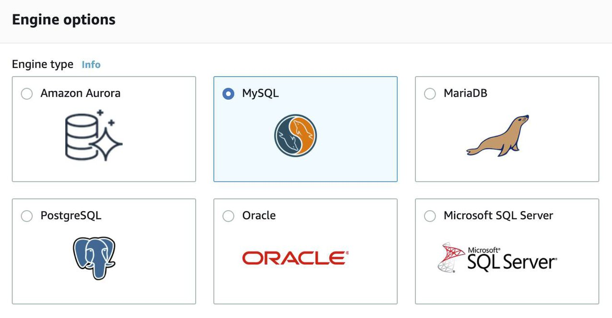
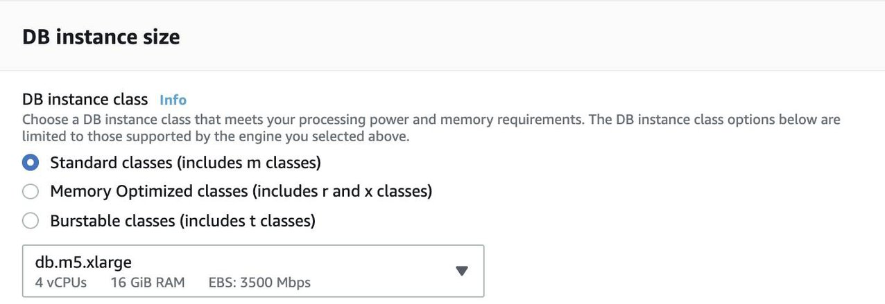
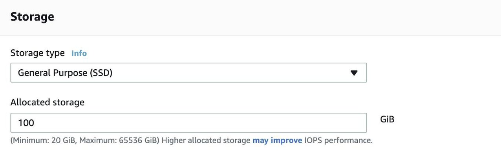
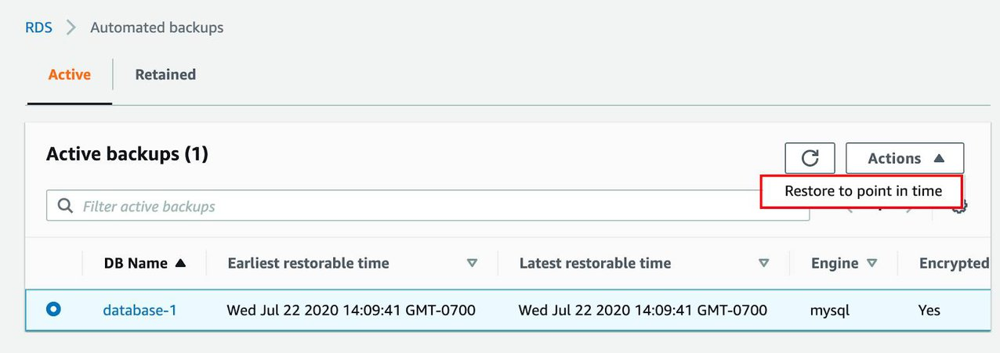
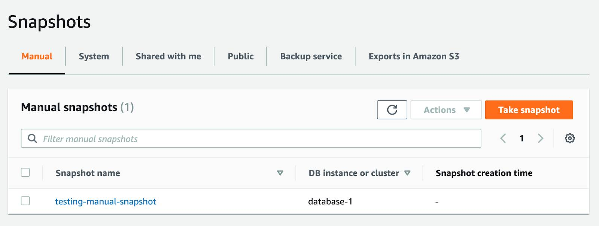

# Amazon RDS

Creation method allows the user to choose how to create the database, in practice a `Standard create` will require a more detailed configuration than `Easy create` which uses the best practices.

Additionally, it is necessary to choose the specific engine (`Oracle`, `SQL Server`, etc). More specifically, `Amazon Aurora` was created specifically for the AWS infrastructure, it can auto-scale up to 128 TiB per database instance.

Next, it is necessary to chose instance size, as well as identifier *Master username*.

# Reading 3.6: Amazon Relational Database Service

## What Is Amazon RDS?

Amazon RDS enables you to create and manage relational databases in the cloud without the operational burden of traditional database management. For example, if you sell healthcare equipment and your goal is to be the number-one seller in the Pacific Northwest, building out a database doesn’t directly help you achieve that goal though having a database is necessary to achieve the goal. Amazon RDS helps you offload some of this unrelated work of creating and managing a database. You can focus on the tasks that differentiate your application, instead of infrastructure-related tasks such as provisioning, patching, scaling, and restoring. Amazon RDS supports most of the popular relational database management systems, ranging from commercial options, open source options, and even an AWS-specific option. Here are the supported Amazon RDS engines.

- Commercial: Oracle, SQL Server
- Open Source: MySQL, PostgreSQL, MariaDB
- Cloud Native: Amazon Aurora

> **Note:** The cloud native option, Amazon Aurora, is a MySQL and PostgreSQL-compatible database built for the cloud. It is more durable, more available, and provides faster performance than the Amazon RDS version of MySQL and PostgreSQL. To learn more about Amazon Aurora, view the [Amazon Aurora FAQs](https://aws.amazon.com/rds/aurora/faqs/).

## Understand DB Instances

Just like the databases that you would build and manage yourself, Amazon RDS is built off of compute and storage. The compute portion is called the DB (database) instance, which runs the database engine. Depending on the engine of the DB instance you choose, the engine will have different supported features and configurations. A DB instance can contain multiple databases with the same engine, and each database can contain multiple tables. Underneath the DB instance is an EC2 instance. However, this instance is managed through the Amazon RDS console instead of the Amazon EC2 console. When you create your DB instance, you choose the instance type and size. Amazon RDS supports three instance families.

- Standard, which include general-purpose instances
- Memory Optimized, which are optimized for memory-intensive applications
- Burstable Performance, which provides a baseline performance level, with the ability to burst to full CPU usage.

The DB instance you choose affects how much processing power and memory it has. Not all of the options are available to you, depending on the engine that you choose. You can find more information about the DB instance types in the resources section of this unit. Much like a regular EC2 instance, the DB instance uses Amazon Elastic Block Store (EBS) volumes as its storage layer. You can choose between three types of EBS volume storage.

- General purpose (SSD)
- Provisioned IOPS (SSD)
- Magnetic storage (not recommended)

## Work with Amazon RDS in an Amazon Virtual Private Cloud

When you create a DB instance, you select the Amazon Virtual Private Cloud (VPC) that your databases will live in. Then, you select the subnets that you want the DB instances to be placed in. This is referred to as a DB subnet group. To create a DB subnet group, you specify:

- The Availability Zones (AZs) that include the subnets you want to add
- The subnets in that AZ where your DB instance are placed

The subnets you add should be private so they don’t have a route to the internet gateway. This ensures your DB instance, and the data inside of it, can only be reached by the app backend. Access to the DB instance can be further restricted by using network access control lists (ACLs) and security groups. With these firewalls, you can control, at a granular level, what type of traffic you want to allow into your database. Using these controls provide layers of security for your infrastructure. It reinforces that only the backend instances have access to the database.

## Use AWS Identity and Access Management (IAM) Policies to Secure Amazon RDS

Network ACLs and security groups allow you to dictate the flow of traffic. If you want to restrict what actions and resources your employees can access, you can use IAM policies.

## Back Up Your Data

You don’t want to lose any of that precious information. To take regular backups of your RDS instance, you can use:

- Automatic backups
- Manual snapshots

### Automatic Backups

Automated backups are turned on by default. This backs up your entire DB instance (not just individual databases on the instance), and your transaction logs. When you create your DB instance, you set a backup window that is the period of time that automatic backups occur. Typically, you want to set these windows during a time when your database experiences little activity because it can cause increased latency and downtime.

You can retain your automated backups between 0 and 35 days. You might ask yourself, “Why set automated backups for 0 days?” The 0 days setting actually disables automatic backups from happening. Keep in mind that if you set it to 0, it will also delete all existing automated backups. This is not ideal, as the benefit of having automated backups is having the ability to do point-in-time recovery.

If you restore data from an automated backup, you have the ability to do point-in-time recovery. Point-in-time recovery creates a new DB instance using data restored from a specific point in time. This restoration method provides more granularity by restoring the full backup and rolling back transactions up to the specified time range.

### Manual Snapshots

If you want to keep your automated backups longer than 35 days, use manual snapshots. Manual snapshots are similar to taking EBS snapshots, except you manage them in the RDS console. These are backups that you can initiate at any time, that exist until you delete them.

For example, to meet a compliance requirement that mandates you to keep database backups for a year, you would need to use manual snapshots to ensure those backups are retained for that period of time.

If you restore data from a manual snapshot, it creates a new DB instance using the data from the snapshot.

### Which Backup Option Should I Use?

The answer, almost always, is both. Automated backups are beneficial for the point-in-time recovery. Manual snapshots allow you to retain backups for longer than 35 days.

## Get Redundancy with Amazon RDS Multi-AZ

When you enable Amazon RDS Multi-AZ, Amazon RDS creates a redundant copy of your database in another AZ. You end up with two copies of your database: a primary copy in a subnet in one AZ and a standby copy in a subnet in a second AZ.

The primary copy of your database provides access to your data so that applications can query and display that information.

The data in the primary copy is synchronously replicated to the standby copy. The standby copy is not considered an active database, and does not get queried by applications.

To improve availability, Amazon RDS Multi-AZ ensures that you have two copies of your database running and that one of them is in the primary role. If there’s an availability issue, such as the primary database losing connectivity, Amazon RDS triggers an automatic failover.

When you create a DB instance, a domain name system (DNS) name is provided. AWS uses that DNS name to failover to the standby database. In an automatic failover, the standby database is promoted to the primary role and queries are redirected to the new primary database.

To ensure that you don’t lose Multi-AZ configuration, a new standby database is created by either:

- Demoting the previous primary to standby if it’s still up and running
- Or standing up a new standby DB instance

The reason you can select multiple subnets for an Amazon RDS database is because of the Multi-AZ configuration. You’ll want to ensure that you have used subnets in different AZs for your primary and standby copies.
